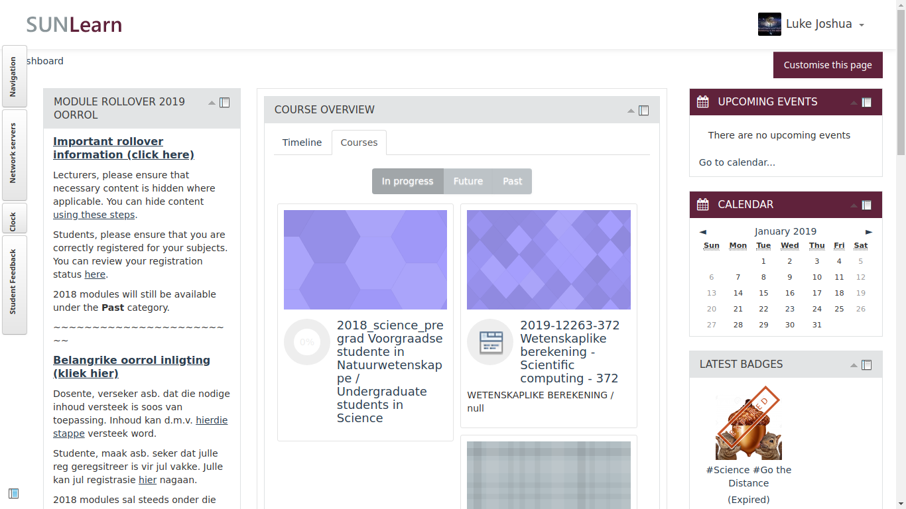
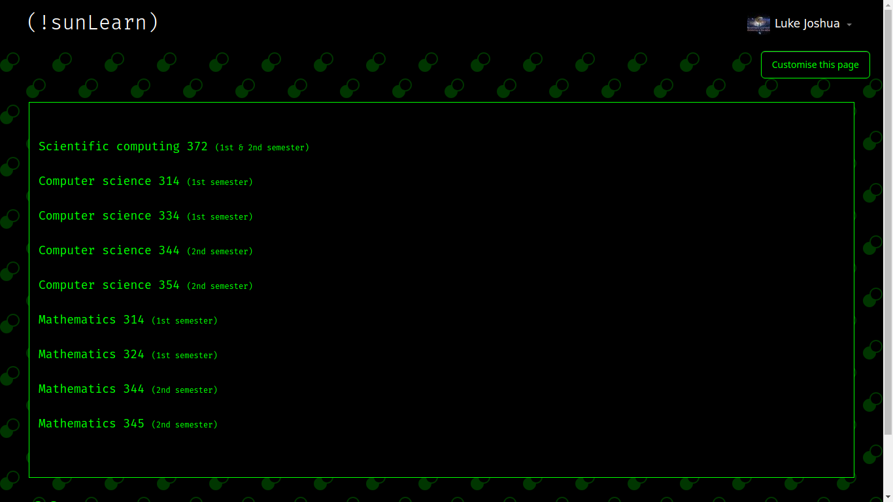
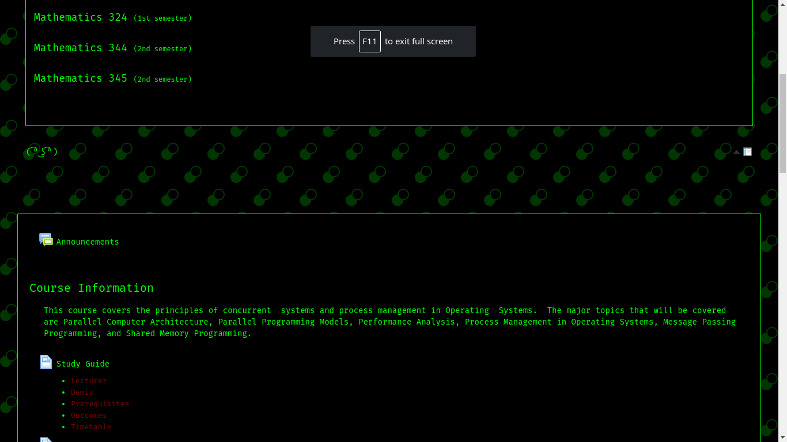

# USE AT OWN RISK
### How to apply the theme
For best results, remove all other blocks and place the HTML block directly
below the list of courses.

1. Open the sunlearn dashboard.
2. Click the 'Customize the page' button.
3. Add a new block.
4. Choose HTML block.
5. When the editor appears, click the button to show all the options.
6. You should see a `<>` button. Click it.
7. Paste the contents of [main.html](main.html) into the text area.
8. Click update.
9. Return to the dashboard and check that everything works.

### Before

### After

